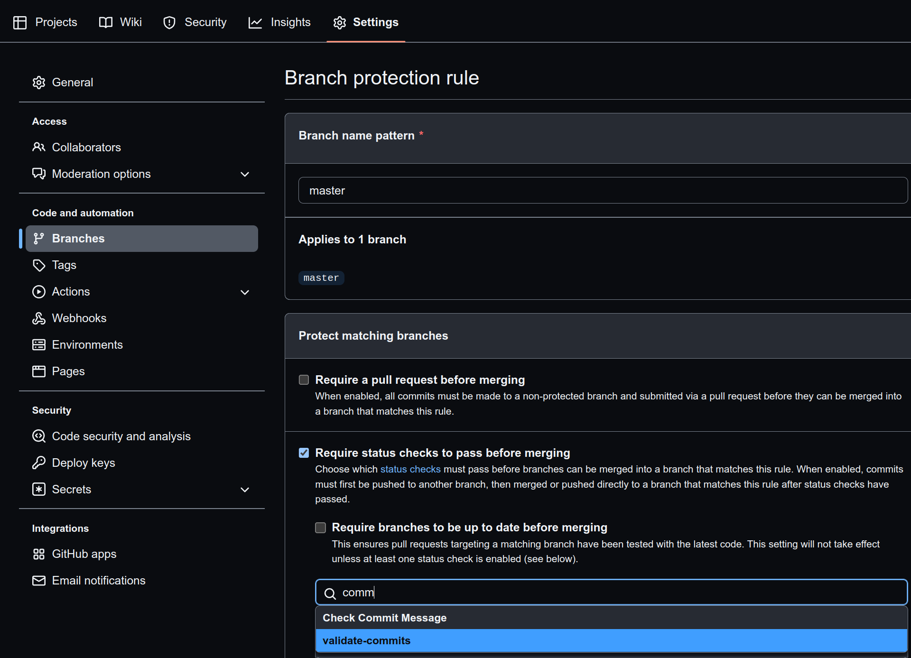

Example of git action that check commit message and decline request with invalid message

* Add action `.github.workflows.commitlint.yml`
* Add require status checks to pass before merging `Settings->Branches->Branch protection rules`
  